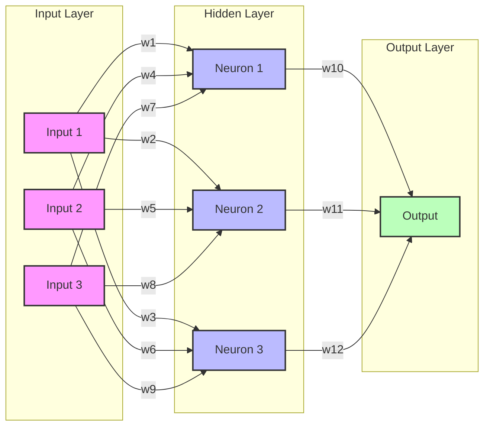

# Understanding Neural Networks

Neural networks are capable of learning and identifying patterns directly from data without pre-defined rules. These networks are built from several key components:

1. **Neurons**: The basic units that receive inputs, each neuron is governed by a threshold and an activation function.
2. **Connections**: Links between neurons that carry information, regulated by weights and biases.
3. **Weights and Biases**: These parameters determine the strength and influence of connections.
4. **Propagation Functions**: Mechanisms that help process and transfer data across layers of neurons.
5. **Learning Rule**: The method that adjusts weights and biases over time to improve accuracy.

## Key Features:

1. **Input Layer**: Receives raw data from the external environment
2. **Hidden Layer**: Processes the weighted inputs using activation functions
3. **Output Layer**: Produces the final network output
4. **Weights (w1-w12)**: Adjustable parameters that determine connection strengths
5. **Activation Flow**: Information flows from left to right, with each connection modified by its weight

The diagram above illustrates a simple feedforward neural network with three input neurons, three hidden neurons, and one output neuron. The connections between neurons (shown as arrows) represent weights that are adjusted during training to optimize the network's performance.