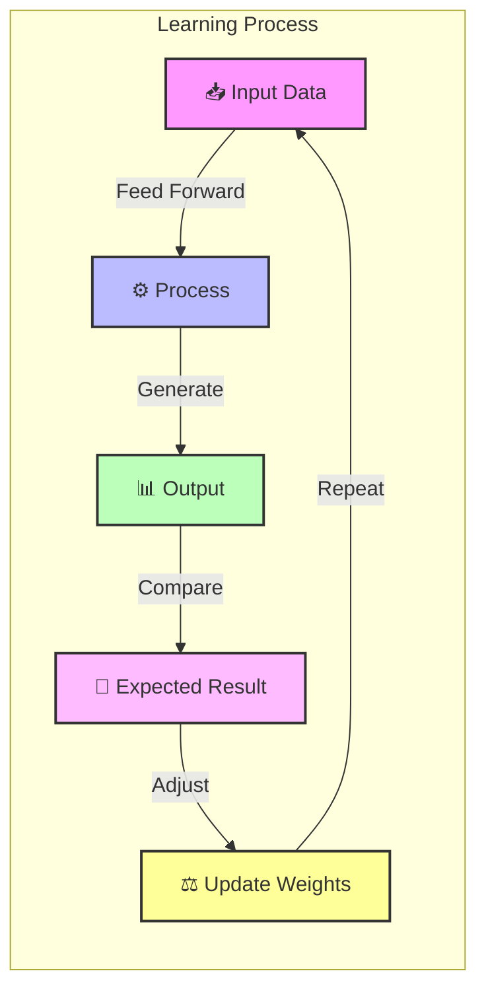

# 🧠 Learning in Neural Networks

Learning in neural networks follows a structured, three-stage process:

## 🔄 The Learning Cycle

1. **Input Computation** 📥
   - Data is fed into the network
   - Raw information is processed through input layers
   - Features are extracted automatically
   
2. **Output Generation** ⚡
   - Based on the current parameters, the network generates an output
   - Each neuron contributes to the final prediction
   - Activation functions determine neuron behavior

3. **Iterative Refinement** 🎯
   - The network refines its output by adjusting weights and biases
   - Gradual improvement through backpropagation
   - Performance enhances with each training iteration

## 🌟 Key Benefits

- **Adaptive Learning** 🔄: Networks continuously improve with more data
- **Pattern Recognition** 👁️: Ability to identify complex patterns
- **Generalization** 🎯: Can handle new, unseen data effectively
- **Automatic Feature Extraction** ⚡: No manual feature engineering needed

## 💡 Applications

- **Computer Vision** 👁️
- **Natural Language Processing** 📝
- **Speech Recognition** 🎤
- **Game Playing** 🎮
- **Medical Diagnosis** ⚕️

The learning process is continuous and cyclical, allowing neural networks to become increasingly accurate at their assigned tasks through repeated exposure to training data and adjustment of internal parameters.