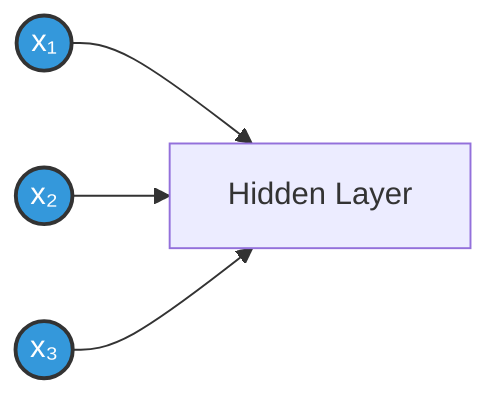
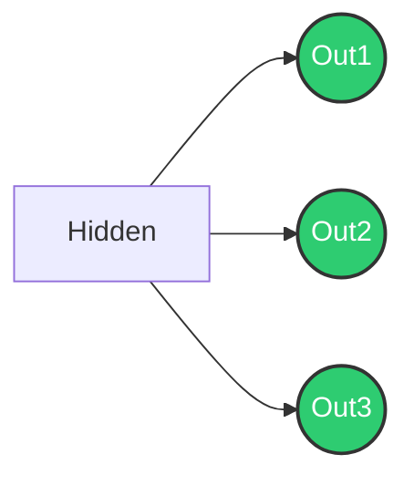

# Layers in Neural Network Architecture 🧠

## Understanding Neural Network Layers 🔍
A neural network is like a sandwich - each layer adds something special to make the whole thing work!

## 1. Input Layer 📥
This is the "front door" of your neural network. It's where your data first enters.

### Characteristics:
- Each input neuron = one piece of information
- No computation happens here
- Number of neurons = number of features in your data

### Real-world Example: Image Processing 🖼️
```
For a 28x28 pixel image:
- Each pixel is an input
- Total inputs = 28 × 28 = 784 neurons

Example structure:
[Pixel 1: 255] →
[Pixel 2: 128] →
[Pixel 3: 0  ] →
...784 total
```



## 2. Hidden Layers 🔄
The "brain" of your network where the magic happens!

### Characteristics:
- Can have multiple layers
- Each layer learns different features
- More layers = more complex patterns

### Types of Hidden Layers:
1. **Dense/Fully Connected**
```
    [h₁]
[x] →[h₂]→ Every input connects to every neuron
    [h₃]
```

2. **Convolutional (for images)**
```
[Image] → [Edge Detection] → [Pattern Detection]
```


## 3. Output Layer 🎯
The "decision maker" of your network.

### Output Types:
1. **Binary Classification** (Yes/No)
```
Single Neuron:
→ [0 or 1]
Example: Is it a cat? (1=Yes, 0=No)
```

2. **Multi-class Classification**
```
Multiple Neurons:
→ [Cat  : 0.8]
→ [Dog  : 0.1]
→ [Bird : 0.1]
```

3. **Regression** (Predicting numbers)
```
Single Neuron:
→ [42.5]
Example: Predicting house prices
```



## Complete Network Architecture 🌟

```
Simple Network ASCII Representation:

Input         Hidden          Output
Layer         Layers          Layer
  
[x₁] →       [h₁₁] →        
[x₂] → → →   [h₁₂] → → →   [Output]
[x₃] →       [h₁₃] →        
```

## Layer Sizing Guidelines 📏

1. **Input Layer**
   - Same as number of features
   - Example: 784 for MNIST digits

2. **Hidden Layers**
   - First hidden layer: 2/3 of input size
   - Each subsequent layer: 2/3 of previous
   - Example for 784 inputs:
     ```
     Input:  784
     Hidden1: 523
     Hidden2: 349
     Hidden3: 233
     ```

3. **Output Layer**
   - Binary: 1 neuron
   - Multi-class: Number of classes
   - Regression: Number of values to predict

## Common Layer Patterns 🔨

```
Computer Vision:
Input → Conv → Pool → Conv → Pool → Dense → Output

Natural Language:
Input → Embed → LSTM → Dense → Output

Simple Data:
Input → Dense → Dense → Output
```

## Key Points to Remember 🔑

1. Input layer is just a passthrough
2. Hidden layers do the learning
3. Output layer shape depends on your task
4. More layers ≠ always better
5. Layer size decreases as you go deeper

Remember: Think of these layers like an assembly line 🏭
1. Input Layer: Raw materials (data)
2. Hidden Layers: Factory workers (processing)
3. Output Layer: Final product (prediction)
