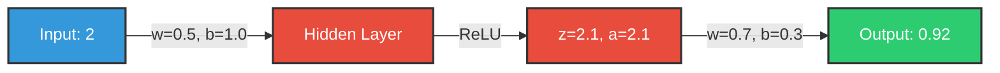

# Forward Propagation in Neural Networks 🔄

## What is Forward Propagation? 🤔
Forward propagation is like a conveyor belt in a factory, where data moves forward through the neural network, getting processed at each step.

## The Process Step by Step 📝

### 1. Linear Transformation ➗
Think of this as the "math part" where we:
- Multiply inputs by weights
- Add them all up
- Add a bias

```
Simple Example:
Input: x₁ = 1, x₂ = 2
Weights: w₁ = 0.5, w₂ = 0.3
Bias: b = 1

Calculation:
z = (w₁ × x₁) + (w₂ × x₂) + b
z = (0.5 × 1) + (0.3 × 2) + 1
z = 0.5 + 0.6 + 1
z = 2.1
```

### 2. Activation Function 🔥
This is where we add some "spice" to our calculation. It helps the network learn complex patterns.

Popular Activation Functions:

#### ReLU (Rectified Linear Unit) 📈
```
If input > 0: output = input
If input ≤ 0: output = 0

Example:
Input z = 2.1
ReLU(2.1) = 2.1

Input z = -1.5
ReLU(-1.5) = 0
```

#### Sigmoid Function 〽️
```
Converts any number into a value between 0 and 1

Example:
Input z = 2.1
sigmoid(2.1) ≈ 0.89

Input z = -1.5
sigmoid(-1.5) ≈ 0.18
```

## Visual Example of Forward Propagation 🎨



## Simple Network Structure in ASCII
```
Input       Hidden          Output
Layer       Layer           Layer
   
  [2] ----→ [ReLU(2.1)] ----→ [0.92]
      w=0.5     |          w=0.7
      b=1.0     |          b=0.3
                |
         activation=ReLU
```

## Complete Example Walkthrough 🚶

1. **Input Layer** 📥
   - Receives the input value: 2

2. **Hidden Layer Calculation** 🧮
   ```
   Linear transformation:
   z = (2 × 0.5) + 1.0 = 2.1
   
   Activation (ReLU):
   a = ReLU(2.1) = 2.1
   ```

3. **Output Layer Calculation** 🎯
   ```
   Final calculation:
   output = (2.1 × 0.7) + 0.3 = 0.92
   ```

## Mathematical Representation 📐
```
Forward Propagation Steps:

1. Hidden Layer:
   z₁ = w₁x + b₁
   a₁ = ReLU(z₁)

2. Output Layer:
   z₂ = w₂a₁ + b₂
   output = z₂
```

## Key Points to Remember 🔑

1. Data always flows forward (left to right) ➡️
2. Each connection has a weight (w) 🏋️
3. Each neuron has a bias (b) ➕
4. Activation functions add non-linearity 📈
5. The process repeats for each layer 🔄

## Common Mistakes to Avoid ⚠️

1. Forgetting to add the bias
2. Skipping the activation function
3. Mixing up the order of operations
4. Not keeping track of dimensions

Remember: Forward propagation is just math with extra steps! 🧮

## Real-world Analogy 🌍
Think of forward propagation like a recipe:
```
Input (Ingredients) → Hidden Layer (Mixing & Cooking) → Output (Final Dish)
            2       →     Mix with weights & bias     →    0.92
                   →     Apply heat (activation)      →
```
