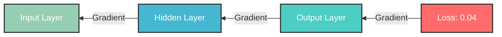

# Backpropagation in Neural Networks 🔄

## What is Backpropagation? 🤔
Think of backpropagation like a teacher grading a test and providing feedback. The network makes a prediction (takes the test), sees how wrong it was (gets the grade), and then learns from its mistakes (improves for next time).

## The Process Step by Step 📝

### 1. Loss Calculation 📊
First, we measure how wrong our prediction was.

```
Example using Mean Squared Error (MSE):
Predicted value: 0.8
Actual value: 1.0

MSE = (predicted - actual)²
MSE = (0.8 - 1.0)²
MSE = (-0.2)²
MSE = 0.04
```

### 2. Gradient Calculation 📉
We figure out how much each weight contributed to the error.



Simple Example:
```
Network Structure:
[Input: 2] → [Hidden: 1.5] → [Output: 0.8]
              Weight: 0.5     Weight: 0.7

Gradients flow backwards:
Output → Hidden → Input
0.04  → 0.028  → 0.014
```

### 3. Weight Update 🔧
We adjust the weights based on what we learned.

```
Weight Update Formula:
new_weight = old_weight - (learning_rate × gradient)

Example (learning_rate = 0.1):
Old weight: 0.5
Gradient: 0.028

New weight = 0.5 - (0.1 × 0.028)
           = 0.5 - 0.0028
           = 0.4972
```

## Visual Example of Full Process 🎨

```
Forward Pass:
Input → Hidden → Output → Loss
  2   →  1.5   →  0.8   → 0.04
    ↗         ↗
  w=0.5     w=0.7

Backward Pass:
Input ← Hidden ← Output ← Loss
0.014 ← 0.028  ← 0.04   ← 0.04
    ←         ←
 Update     Update
 w=0.5     w=0.7
```

## Common Loss Functions 📈

1. **Mean Squared Error (MSE)** - For Regression
```
MSE = (predicted - actual)²

Example:
Predicted: [0.8, 0.6]
Actual:    [1.0, 0.5]
MSE = [(0.8-1.0)² + (0.6-0.5)²] / 2
    = [0.04 + 0.01] / 2
    = 0.025
```

2. **Binary Cross-Entropy** - For Binary Classification
```
BCE = -(actual × log(predicted) + (1-actual) × log(1-predicted))

Example:
Predicted: 0.8
Actual: 1.0
BCE = -(1.0 × log(0.8) + (1-1.0) × log(1-0.8))
    = -log(0.8)
    ≈ 0.223
```

## Learning Rate Importance 🎯

```
Too Small (0.0001):
Old Weight: 0.5
New Weight: 0.49997 (Barely changed!)

Just Right (0.1):
Old Weight: 0.5
New Weight: 0.4972 (Good step!)

Too Large (1.0):
Old Weight: 0.5
New Weight: 0.472 (Too big a jump!)
```

## Key Points to Remember 🔑

1. Backpropagation flows backwards ⬅️
2. Small learning rate = slow but stable learning 🐢
3. Large learning rate = fast but might overshoot 🐇
4. Loss functions measure the error 📏
5. Gradients show which weights to adjust ⚖️

## Common Mistakes to Avoid ⚠️

1. Learning rate too high/low
2. Wrong loss function for the task
3. Vanishing/exploding gradients
4. Not normalizing input data

## Real-world Analogy 🌍
Think of backpropagation like learning to cook:
```
Forward: Cook meal → Taste → Rate taste (Loss)
Backward: Adjust recipe ← Learn from mistakes ← Understand what went wrong
```

Remember: Backpropagation is just the network learning from its mistakes! 🎓
