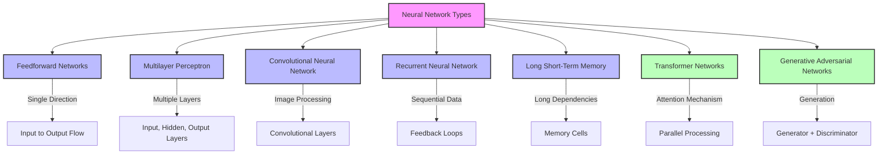

# Learning of a Neural Network

## Learning Approaches

### 1. Learning with Supervised Learning
In supervised learning, a neural network learns from labeled input-output pairs provided by a teacher. The network generates outputs based on inputs, and by comparing these outputs to the known desired outputs, an error signal is created. The network iteratively adjusts its parameters to minimize errors until it reaches an acceptable performance level.

### 2. Learning with Unsupervised Learning
Unsupervised learning involves data without labeled output variables. The primary goal is to understand the underlying structure of the input data (X). Unlike supervised learning, there is no instructor to guide the process. Instead, the focus is on modeling data patterns and relationships, with techniques like clustering and association commonly used.

### 3. Learning with Reinforcement Learning
Reinforcement learning enables a neural network to learn through interaction with its environment. The network receives feedback in the form of rewards or penalties, guiding it to find an optimal policy or strategy that maximizes cumulative rewards over time. This approach is widely used in applications like gaming and decision-making.

## Types of Neural Networks

### Traditional Types
1. **Feedforward Networks**
   - Simplest artificial neural network architecture
   - Data moves from input to output in a single direction
   - No feedback loops or cycles

2. **Multilayer Perceptron (MLP)**
   - Three or more layers including input, hidden, and output layers
   - Uses nonlinear activation functions
   - Fully connected architecture

3. **Convolutional Neural Network (CNN)**
   - Specialized for image processing
   - Uses convolutional layers for feature extraction
   - Automatically learns hierarchical features from images

4. **Recurrent Neural Network (RNN)**
   - Designed for sequential data processing
   - Uses feedback loops for maintaining context
   - Ideal for time series and natural language processing

5. **Long Short-Term Memory (LSTM)**
   - Advanced version of RNN
   - Overcomes vanishing gradient problem
   - Uses memory cells and gates for information control

### Modern Additions
6. **Transformer Networks**
   - Based on attention mechanisms
   - Excellent for parallel processing
   - State-of-the-art in NLP tasks

7. **Generative Adversarial Networks (GANs)**
   - Consists of generator and discriminator networks
   - Used for generating realistic data
   - Applications in image synthesis and data augmentation

Each type of neural network has its specific strengths and ideal use cases, making them suitable for different kinds of problems and applications.
